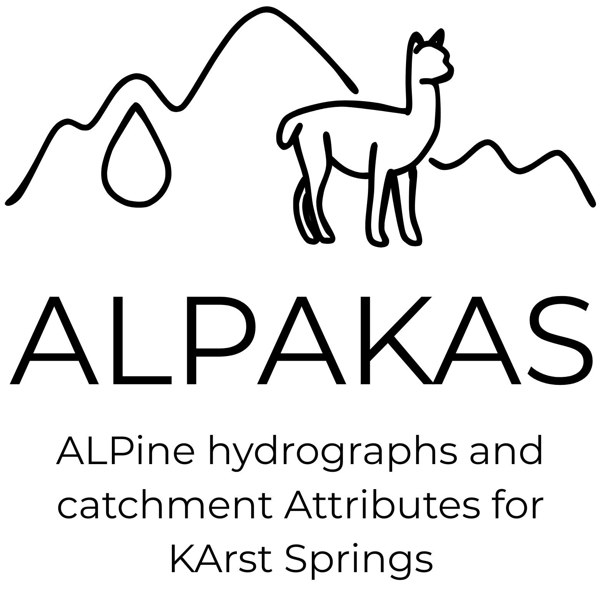

ALPAKAS - Code Repository
================

<p align="center">
 </a>
</p>

This code repository contains all R scripts required to generate the
ALPAKAS dataset from original discharge time series and raw geospatial
inputs. ALPAKAS is freely available via Zenodo at
<https://doi.org/XXXX??> under an open-access licence and described in
the corresponding data descriptor <https://doi.org/XXXX??>. The dataset
was developed as part of the AlKa-DL project.

All data processing were performed in R 4.4 on a Windows Server 2019
Standard system (Version 1809). Climatic indices were computed using
adapted code from Nans Addor (Addor, 2020,
<https://github.com/naddor/camels>, last access: 5 May 2026).

## Getting Started

1.  Set the working directory to the project root (i.e., the top-level
    folder of this repository) or open the project as an R project

2.  Restore the project environment using `renv::restore()`

## Code Description

The code is organized into the subfolders
`step1_discharge_time_series/`, `step2_buffer_approximations/`, and
`step3_catchment_aggregates/`. Each component is executed via a
dedicated main script located in the respective `R/` subfolder, and
should be run in the order listed above.

Collected station metadata, are available in the file
`station_meta_input.csv` in the project root directory. This file
contains the initial metadata compiled prior to preprocessing and serves
as input to the workflow. The following metadata fields are required for
preprocessing:

- `ALPAKAS_ID`
- `country_code`
- `temp_res_orig_inst`
- `temp_res_orig_hourly`
- `temp_res_orig_daily`
- `upstream_stations`

### Discharge Time Series

In Step 1, discharge hydrographs are preprocessed conditionally based on
the temporal resolution class of the original time series, following the
workflow described in detail in Joger et al. ?? and illustrated in
Figure??. Processing is applied sequentially to individual sites within
a loop, with preprocessing steps selected according to the respective
temporal resolution class. The workflow includes manual data quality
control. Quality flagging applied to the original instantaneous time
series is not fully reproducible, as these data could not be made
publicly available. However, for each temporal resolution class, one
representative original time series is provided in the correct format,
including manually assigned quality control flags (instantaneous: Source
de l´Areuse (Bundesamt für Umwelt (BAFU) - Abteilung Hydrologie; subset
2015-2024 due to file size); hourly: Source d´Argens (Service central
d’hydrométéorologie et d’appui à la prévision des inondations (SCHAPI) -
Hydroportail); daily: Source des Frayères (Service central
d’hydrométéorologie et d’appui à la prévision des inondations (SCHAPI) -
Hydroportail)).

**Input data requirements**

Original discharge time series are read as site-specific CSV files
stored in the subfolder `input_data/`, each containing the following
columns:

- `date`: timestamp in `YYYY-mm-dd` or `YYYY-mm-dd HH:MM:SS` format  
- `discharge`: discharge values in L s$^{-1}$  
- `qc_flag`: boolean indicator specifying whether a data point was
  identified as an outlier or artefact during manual quality control  
- `qc_type`: classification of flagged values as “outlier” or “artefact”

**Workflow**

The script `q_main.R` automatically:

1.  reads the prepared input time series  
2.  applies all discharge preprocessing steps  
3.  saves the processed time series at hourly and daily resolution as
    CSV files in `output_data/`

The workflow is temporarily interrupted to allow manual assignment of
quality and resolution flags. Intermediate results are therefore stored
in the subfolder `temp/`. After manual inspection and flag assignment,
the workflow is resumed and the corresponding quality and resolution
information is incorporated into the final dataset.

### Buffer Approximations

In Step 2, catchment buffers are approximated for all sites following
the approach described in Joger et al. ??.

**Input data requirements**

The catchment approximation can be run either with or without tracer
tests. If tracer tests are used, they must be stored in
`input_data/Tracer/` as a GPKG file with the following fields:

- `spring_name`: name of the spring where the tracer was detected (must
  exactly match the names in the ALPAKAS metadata)
- `geometry`: LineString geometry representing the flow path from the
  injection point to the observation point (EPSG:3035)

Data products required to compute the buffer approximations of the
ALPAKAS dataset must be downloaded and stored in the predefined
directory structure within the subfolder `input_data/`. Download links
and instructions are provided in the subsection “Required input
datasets” of this README file, as well as directly in the corresponding
processing scripts.

**Workflow**

The script `buffer_approx_main.R`:

1.  identifies valid hydrological years (hydrological years with $\geq$
    80% data availability for both discharge and meteorological
    variables)
2.  derives catchment approximations based on topography, tracer
    information, and a local water balance approach
3.  saves the resulting catchment approximations as GeoJSON files in the
    subfolder `output_data/`

During processing, additional attributes are derived from discharge time
series and catchment representations and integrated into the final
metadata file `ALPAKAS_station_metadata.csv` in the `output_data/`
subfolder. Intermediate results are stored in the subfolder `temp/`.

### Catchment Aggregates

In Step 3, catchment aggregates are computed for different catchment
representations.

**Input data requirements**

Geospatial data products required to compute the catchment aggregates of
the ALPAKAS dataset must be downloaded and stored in the predefined
directory structure within the subfolder `input_data/`. Download links
and instructions are provided in the subsection “Required input
datasets” of this README file, as well as directly in the corresponding
processing scripts.

**Workflow**

Data processing is performed using the script `catch_attr_main.R`,
which:

1.  harmonizes all data products in an initial step by converting them
    to a common coordinate reference system, consistent units, and by
    cropping them to the study region

2.  computes catchment-level aggregates and stores them as CSV files in
    the subfolder `output_data/` for both

- existing catchment delineations (`catchment_expert/`), and
- buffer-based approximations (`catchment_approx`).

3.  saves the resulting aggregated meteorological time series in daily
    and hourly resolution in `meteorological_time_series/` and static
    catchment attributes in `static_attributes/`

Processed data products and intermediate results required for the
computation of hydrometeorological indices are saved in `temp/`.

## File structure

``` text
project/
├── step1_discharge_time_series/
│   ├── input_data/
│   │   ├── daily/
│   │   ├── hourly/
│   │   └── inst/
│   ├── output_data/
│   │   ├── daily/
│   │   └── hourly/
│   ├── R/
│   └── temp/
│       ├── daily/
│       └── hourly/
├── step2_buffer_approximations/
│   ├── input_data/
│   ├── output_data/
    │   └── catchment_delineations/
│   ├── R/
│   └── temp/
└── step3_catchment_aggregates/
    ├── input_data/
    │   ├── catchment_delineations/
    │   ├── meteo_data_prod/
    │   └── static_data_prod/
    ├── output_data/
    │   ├── catchment_approx/
    │   │   ├── meteorological_time_series/
    │   │   │   ├── daily/
    │   │   │   └── hourly/
    │   │   └── static_attributes/
    │   └── catchment_expert/
    │       ├── meteorological_time_series/
    │       │   ├── daily/
    │       │   └── hourly/
    │       └── static_attributes/
    ├── R/
    └── temp/
        ├── catchment_approx/
        ├── catchment_expert/
        └── proc_data_prod/
```

## Required input datasets

Prior to computing the buffer approximations in step 2, the following
data products must be downloaded and stored in the predefined input
directories under `step2_buffer_approximations/input_data/...`.

| Product name  | Download link                                                                                                | Directory                                    |
|---------------|--------------------------------------------------------------------------------------------------------------|----------------------------------------------|
| GLO-30 DEM    | [Access dataset](https://portal.opentopography.org/raster?opentopoID=OTSDEM.032021.4326.3)                   | `.../static_data_prod/Copernicus_GLO30_DEM/` |
| EEA coastline | [Access dataset](https://www.eea.europa.eu/en/datahub/datahubitem-view/af40333f-9e94-4926-a4f0-0a787f1d2b8f) | `.../static_data_prod/Eea_Coastline/`        |
| ERA5-Land     | [Access dataset](https://cds.climate.copernicus.eu/datasets/reanalysis-era5-land?tab=overview)               | `.../meteo_data_prod/ERA5land/`              |
|               |                                                                                                              |                                              |

Prior to computing the catchment aggregates in step 3, the following
data products must be downloaded and stored in the predefined input
directories under `step3_catchment_aggregates/input_data/...`.

| Product name       | Download link                                                                                                              | Directory                                             |
|--------------------|----------------------------------------------------------------------------------------------------------------------------|-------------------------------------------------------|
| GLO-30 DEM         | [Access dataset](https://portal.opentopography.org/raster?opentopoID=OTSDEM.032021.4326.3)                                 | `.../static_data_prod/Copernicus_GLO30_DEM/`          |
| EU-Hydro           | [Access dataset](https://land.copernicus.eu/en/products/eu-hydro/eu-hydro-river-network-database)                          | `.../static_data_prod/EU_hydro_gpkg_eu/`              |
| MOHP               | [Access dataset](https://www.hydroshare.org/resource/0d6999591fb048cab5ab71fcb690eadb/)                                    | `.../static_data_prod/macro_mohp_feature/`            |
| Köppen-Geiger      | [Access dataset](https://www.gloh2o.org/koppen/)                                                                           | `.../static_data_prod/koppen_geiger_tif/`             |
| MEDKAM             | [Access dataset](https://www.whymap.org/whymap/EN/Maps_Data/Medkam/medkam_node_en.html)                                    | `.../static_data_prod/WHYMAP_MEDKAM/`                 |
| IHME1500           | [Access dataset](https://www.bgr.bund.de/DE/Themen/Grundwasser/Projekte/Flaechen-Rauminformationen/Ihme1500/ihme1500.html) | `.../static_data_prod/IHME1500_v12/`                  |
| ESDD               | [Access dataset](https://esdac.jrc.ec.europa.eu/content/european-soil-database-derived-data)                               | `.../static_data_prod/STU_EU_Layers/`                 |
| EU-SHD             | [Access dataset](https://esdac.jrc.ec.europa.eu/content/3d-soil-hydraulic-database-europe-1-km-and-250-m-resolution)       | `.../static_data_prod/EU_SoilHydroGrids_250m/`        |
| GGT                | [Access dataset](https://www.earthdata.nasa.gov/data/catalog/ornl-cloud-global-soil-regolith-sediment-1304-1)              | `.../static_data_prod/Global_Soil_Regolith_Sediment/` |
| CLC 2018           | [Access dataset](https://land.copernicus.eu/en/products/corine-land-cover/clc2018)                                         | `.../static_data_prod/CLC/`                           |
| RGI v7 (glacier)   | [Access dataset](https://nsidc.org/data/nsidc-0770/versions/7)                                                             | `.../static_data_prod/Randolph_Glacier_Inventory_V7/` |
| LIA (glacier)      | [Access dataset](https://zenodo.org/records/14336827)                                                                      | `.../static_data_prod/LIA_glacier_outlines_Alps/`     |
| Sentinel (glacier) | [Access dataset](https://doi.pangaea.de/10.1594/PANGAEA.909133)                                                            | `.../static_data_prod/c3s_gi_rgi11_s2_2015_v2/`       |
| SPARTACUS 2.1      | [Access dataset](https://data.hub.geosphere.at/dataset/spartacus-v2-1d-1km)                                                | `.../meteo_data_prod/SPARTACUS/`                      |
| MeteoSwiss         | provided upon request                                                                                                      | `.../meteo_data_prod/meteoswiss/`                     |
| HYRAS 6.0          | [Access dataset](https://opendata.dwd.de/climate_environment/CDC/grids_germany/daily/hyras_de/)                            | `.../meteo_data_prod/HYRASv6.0/`                      |
| SAFRAN Sim2        | [Access dataset](https://meteo.data.gouv.fr/datasets/donnees-changement-climatique-sim-quotidienne/)                       | `.../meteo_data_prod/SAFRAN/`                         |
| SLOCLIM            | [Access dataset](https://zenodo.org/records/4108543)                                                                       | `.../meteo_data_prod/SLOCLIM/`                        |
| E-OBS              | [Access dataset](https://surfobs.climate.copernicus.eu/dataaccess/access_eobs.php)                                         | `.../meteo_data_prod/EOBS/`                           |
| ERA5-Land          | [Access dataset](https://cds.climate.copernicus.eu/datasets/reanalysis-era5-land-monthly-means?tab=overview)               | `.../meteo_data_prod/ERA5land/`                       |
|                    |                                                                                                                            |                                                       |
